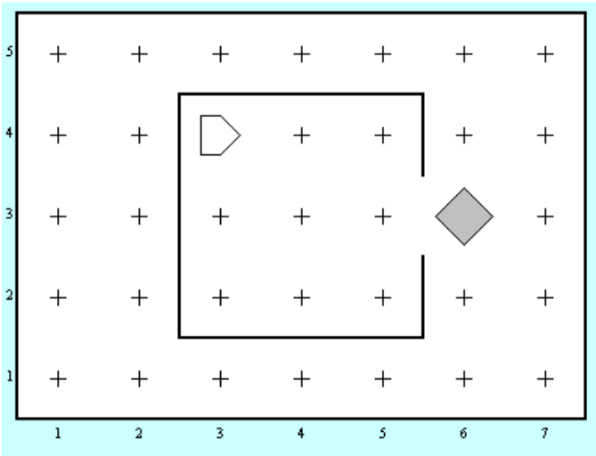

თქვენი პირველი ამოცანაა კარელის სამყაროში მარტივი პროგრამის დაწერა. 

კარელი იმყოფება **ზუსტად** ისეთ სამყაროში, როგორიც სურათზეა. 

## მოცემულობა

| | | 
|---|---|
| სამყაროს ზომა | 7x5 |
| კარელის საწყისი პოზიცია | (3,4) |
| გაზეთ(ებ)ის მდებარეობა | (6,3) |
| კედლები | იხილეთ სურათი და მიმაგრებული ფაილ(ებ)ი |

## დავალება
კარელი:
1. მივიდეს გაზეთთან
2. აიღოს გაზეთი
3. დაბრუნდეს საწყის პოზიციაზე 

მიუხედავად იმისა, რომ პროგრამა სულ რამოდენიმე ხაზს შეიცავს, კარგი იქნება თუ კარელს დამატებით ფუნქციებს ასწავლით. მაგალითად, კარამდე მისვლას.

