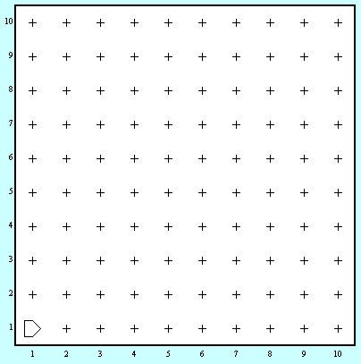
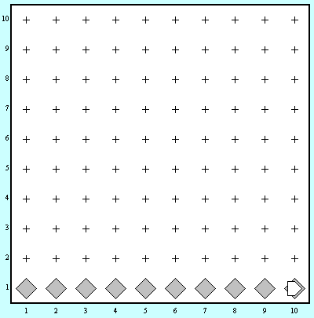

მეორე დავალების მეორე ამოცანაა სტრიქონის შევსების ამოცანაა. 

კარელი შეიძლება ნებისმიერი ზომის სამყაროში იმყოფებოდეს. თუმცა სამყარო ყოველთვის ცარიელი იქნება.

## მოცემულობა

| | | 
|---|---|
| სამყაროს ზომა | N*M |
| კარელის საწყისი პოზიცია | (1,1) |

## დავალება
კარელი დგას 1x1 უჯრაზე, შეავსებინეთ მას პირველი ქუჩა ბრილიანტებით. ანუ
პირველი ქუჩის ყველა უჯრაზე უნდა იდოს ზუსტად ერთი ბრილიანტი. ჩათვალეთ რომ საწყის
სამყაროში ბრილიანტები არსად არ დევს. თქვენმა პროგრამამ უნდა იმუშოს ყველა
ზომის სამყაროსთვის.

მაგალითი 10x10 სამყაროს დროს:

|დაწყებამდე|დამთავრებისას|
|---|---|
|||
