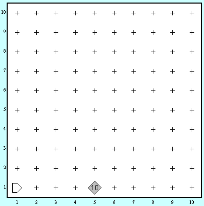
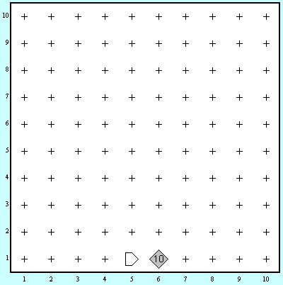

მეორე დავალების პირველი ამოცანაა ბრილიანტების გადალაგების ამოცანა. 

კარელი იმყოფება ისეთ სამყაროში, როგორიც სურათზეა. თუმცა საწყისი ბრილიანტების რაოდენობა შეიძლება განსხვავებული იყოს. [(სამყაროს ფაილის გადმოწერა)](https://freeuni-digital-technologies.github.io/content/homework/worlds/hw2move.w)

## მოცემულობა

| | | 
|---|---|
| სამყაროს ზომა | 10x10 |
| კარელის საწყისი პოზიცია | (1,1) |
| ბრილიანტ(ებ)ის მდებარეობა | (5,1) |
| ბრილიანტ(ებ)ის საბოლოო მდებარეობა | (6,1) |

კარელის საბოლოო პოზიციას მნიშნველობა არ აქვს.

## დავალება
კარელის დავალება არის რომ საწყის პოზიციაზე(5x1) დალაგებული _X_ რაოდენობის ბრილიანტი გადაიტანოს საბოლოო პოზიციაზე(6x1).

მაგალითისთვის თუ დევს 10 ბრილიანტი:

|დაწყებამდე|დამთავრებისას|
|---|---|
|||
