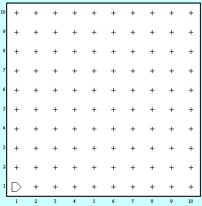
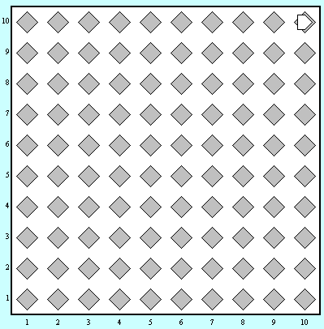

მესამე დავალების პირველი ამოცანა არის დაფის ბიპერებით შევსების ამოცანა. 

კარელი შეიძლება ნებისმიერი ზომის სამყაროში იმყოფებოდეს. თუმცა სამყარო ყოველთვის ცარიელი იქნება.

## მოცემულობა

| | | 
|---|---|
| სამყაროს ზომა | N*M |
| კარელის საწყისი პოზიცია | (1,1) |

## დავალება
მოცემული გაქვთ ცარიელი კვადრატული ფორმის სამყარო. თქვენი ამოცანაა ბრილიანტებით შეავსოთ მთლიანი სამყარო, ისე როგორც ნაჩვენებია ქვემოთ:

მაგალითი 10x10 სამყაროს დროს:

|დაწყებამდე|დამთავრებისას|
|---|---|
|||
