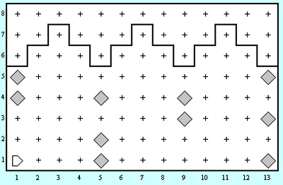
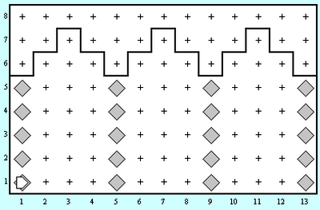

კარელი დაიქირავეს იმისთვის რათა შეაკეთოს მიწისძვრის მიერ მიყენებული დაზიანებები.
კონკრეტულად კი კარელს ევალება შეაკეთოს თაღები, რომელთა სვეტებსაც აკლია აგურები (აგურები, რა თქმა უნდა, წარმოდგენილია როგორც ბრილიანტები).

თქვენმა პროგრამამ სწორად უნდა იმუშაოს სამყაროში რომელიც ნაჩვენებია ქვემოთ. მაგრამ, ასევე, უნდა იყოს საკმარისად ზოგადი რათა შეაკეთოს თაღები ნებისმიერ სხვა სამყაროში, რომელიც აკმაყოფილებს ამოცანის ბოლოში მოყვანილ პირობებს. მოცემული გაქვთ ორი სამაგალითო სამყარო: [(პირველი სამყაროს ფაილის გადმოწერა)](https://freeuni-digital-technologies.github.io/content/homework/worlds/columns.w) [(მეორე სამყაროს ფაილის გადმოწერა)](https://freeuni-digital-technologies.github.io/content/homework/worlds/columns_tall.w)

## მოცემულობა

| | | 
|---|---|
| სამყაროს ზომა | N*M |
| კარელის საწყისი პოზიცია | (1,1) |
| სვეტებს შორის დაშორება | 4 |

## დავალება
კარელმა თითოეულ სვეტში უნდა შეავსოს ყველა ის ადგილი სადაც აგური აკლია.

კარელს შეუძლია დაეყრდნოს შემდეგ ფაქტებს:
* კარელის საწყისი პოზიციაა პირველი გამზირის პირველი ქუჩა. იგი იყურება აღმოსავლეთისკენ და მას აქვს უსასრულოდ ბევრი აგური.
* სვეტები დაშორებულია ერთმანეთისგან __ზუსტად ოთხი ერთეულით__, ისინი განლაგებულია პირველ გამზირზე, მეხუთე გამზირზე, მეცხრე გამზირზე და ა.შ. 
* __ბოლო სვეტი არის სამყაროს ბოლოში__, ანუ ბოლო სვეტის შემდეგ აუცილებლად არის საზღვრის კედელი. მოცემულ მაგალითში ბოლო სვეტი არის მე–13–ე გამზირზე, მაგრამ თქვენი პროგრამა უნდა მუშაობდეს სვეტების ნებისმიერი რაოდენობისთვის.
* სვეტის წვერო ასევე შემოსაზღვრულია კედლით, მაგრამ __კარელმა არ უნდა ჩათვალოს ის რომ სვეტების სიმაღლე ყოველთვის 5 ერთეულია__ და ყველა სვეტი ერთი და იმავე სიმაღლისაა.
* ზოგიერთ სვეტს შეიძლება უკვე ჰქონდეს ზოგიერთი აგური, თქვენმა __პროგრამამ არ უნდა დადოს მეორე აგური იქ სადაც უკვე არის ერთი__.
* არ აქვს მნიშვნელობა კარელი რომელ წერტილში დაამთავრებს მუშაობას.

პირველი სამყაროს მაგალითი:

|დაწყებამდე|დამთავრებისას|
|---|---|
|||
